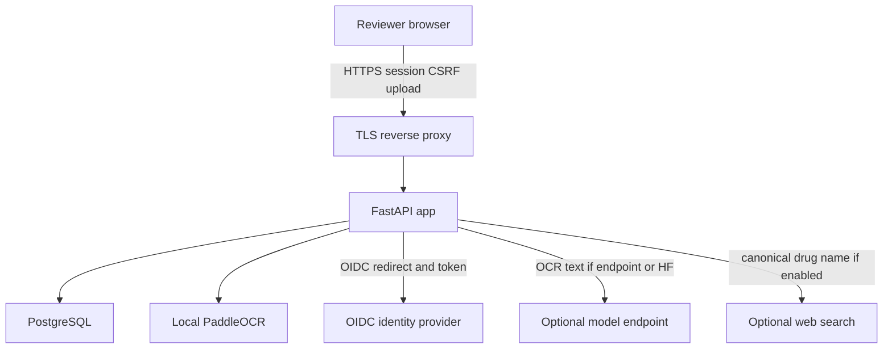

# SimpliScribe threat model

Assumptions (operator should confirm): private authenticated deployment behind TLS; not a public Hugging Face Space; identifiable prescriptions only after consent/retention review; no Redis, no commercial drug APIs, no multi-tenant product beyond `owner_id`.

Out of scope: diagnosis, prescribing, medication reminders, interaction decisioning, identity-provider availability, disaster-region recovery.

## System model

Runtime is a FastAPI app (`simpliscribe/main.py`, ASGI export `app:app`) with PaddleOCR, heuristic or HTTP/Hugging Face structuring, SQLAlchemy storage, and optional DuckDuckGo/model alternative lookup.

## Trust boundaries

| Boundary | Data | Channel | Existing controls | Evidence |
| --- | --- | --- | --- | --- |
| Browser to app | Credentials, uploads, reviews | HTTPS via proxy; cookies | Session middleware, CSRF, CSP/HSTS in production, login and analysis rate limits | `simpliscribe/main.py` middleware and `_consume_bucket` |
| App to database | Analysis JSON, audit rows | SQLAlchemy URL | Production requires PostgreSQL; queries use bound parameters; history filtered by `owner_id` | `simpliscribe/config.py` `validate_runtime`; `simpliscribe/storage.py` |
| App to OCR/parsers | Image/PDF bytes | Local files | Extension allow-list, size/page/pixel limits, content validation, unlink after use | `simpliscribe/web.py` `save_upload`; `simpliscribe/ocr.py` |
| App to IdP | Auth code, PKCE, ID token | HTTPS | Discovery HTTPS check, PKCE, audience check, least-privilege role map | `simpliscribe/security.py` |
| App to model/web | OCR text or canonical medicine name | HTTPS | Alternatives fail-closed (`ALTERNATIVES_ENABLED`); only name sent for web/model; local CSV validation | `simpliscribe/alternatives.py`; `simpliscribe/inference.py` |

## Assets

- Prescription images in transit and OCR text at rest in `analyses.payload`
- Session secret, OIDC client secret, bootstrap password, database URL
- Review integrity (versioned medication state)
- Local medicine CSVs (integrity of reference names, not clinical truth)

## Abuse paths

| ID | Goal | Likelihood | Impact | Priority | Notes |
| --- | --- | --- | --- | --- | --- |
| T1 | Steal or guess bootstrap password on a shared deploy | Medium if OIDC unused | High (full admin) | High | Prefer OIDC; keep bootstrap as break-glass only |
| T2 | Cross-account analysis read | Low if auth on | High | High | Mitigated by `owner_id` filters; unauthenticated local mode is one-user only |
| T3 | CSRF review or analyze | Low | Medium | Medium | CSRF required on login, analyze, review, logout |
| T4 | Malicious PDF/image parser exploit | Medium | High (RCE/DoS) | High | Bounded size; still a parser risk; run non-root in Docker |
| T5 | SSRF via `MODEL_API_URL` / OIDC issuer | Low (operator-set) | High | Medium | Operator-controlled URLs; do not expose a URL field to reviewers |
| T6 | Off-box leakage of prescription text via alternatives or HF | High if those flags on | High | High | Default `ALTERNATIVES_ENABLED=false`; production README keeps fallback/local |
| T7 | Rate-limit bypass via spoofed `X-Forwarded-For` | High if `TRUST_PROXY_HEADERS=true` without stripping | Medium | Medium | Flag defaults false |
| T8 | Restore drill pointed at production | Medium (ops error) | High | High | Script refuses same target and names without restore/verify/test |
| T9 | Public Space upload of identifiable prescriptions | High if deployed public | High | High | README forbids public HF Space uploads |

## Existing mitigations

- Production fail-closed: session secret length, PostgreSQL, HTTPS OIDC, optional bootstrap if OIDC complete
- Role map: admin/reviewer/auditor; edit routes `require_edit_role`
- Upload deleted after processing; analyses expire via `RETENTION_DAYS`
- Degraded pipeline returns labeled payloads or error codes instead of silent partials
- Recovery verifier guards in `scripts/verify-postgres-recovery.ps1` and `.sh`

## Recommended operator actions

- Use OIDC before onboarding multiple reviewers; store bootstrap password in a secret manager
- Terminate TLS at a proxy that strips inbound `X-Forwarded-For` before setting `TRUST_PROXY_HEADERS=true`
- Keep alternatives and Hugging Face off for identifiable data unless the destination is approved
- Record restore drills against disposable databases only
- Confirm CSV licensing before redistribution

Residual risk: PDF/image parsers, operator-configured outbound HTTP, and any unauthenticated local bind to a reachable network.
